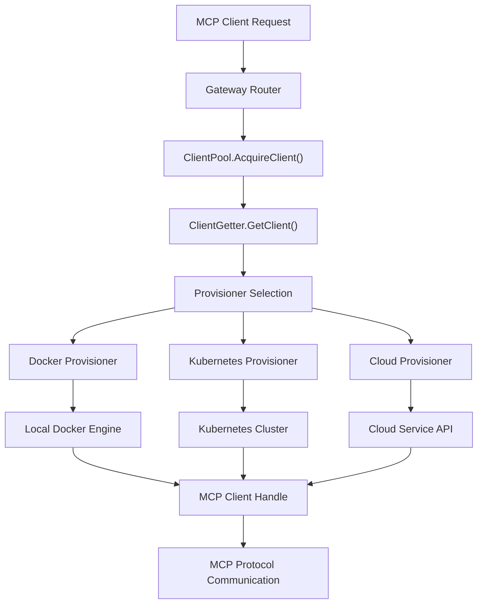
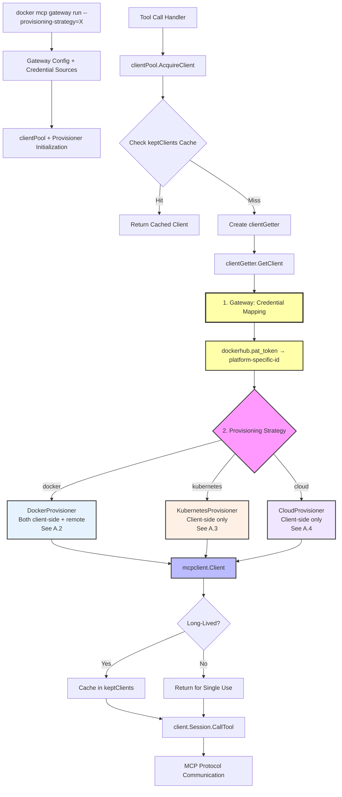
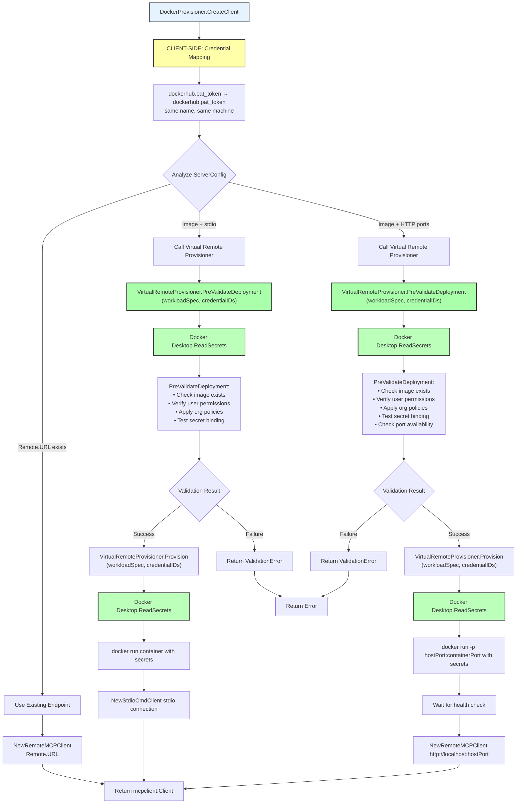
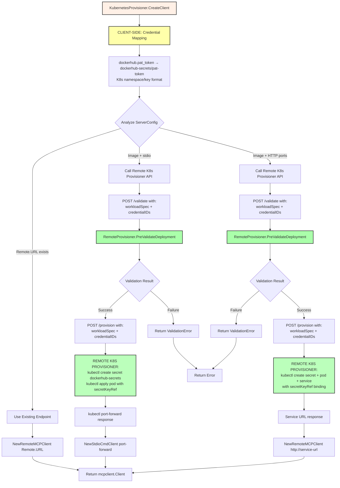
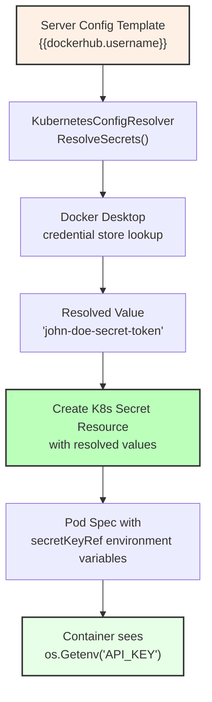
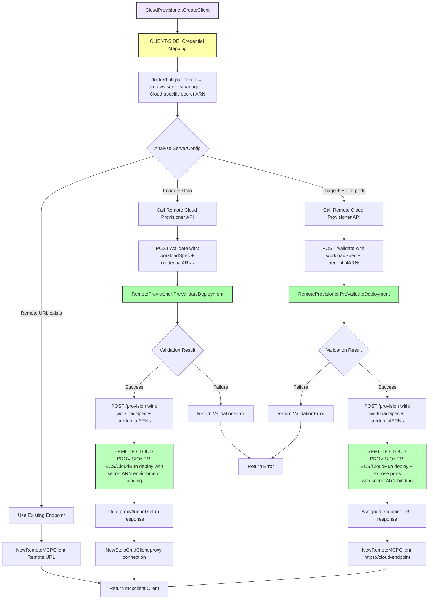
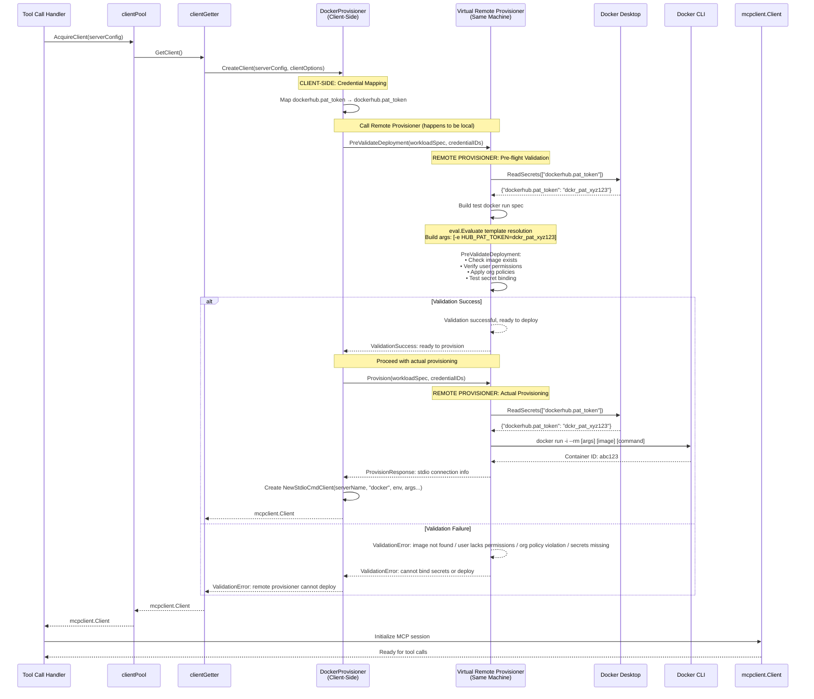

# Feature Specification: Pluggable Provisioning Strategies

## Overview

This specification introduces pluggable provisioning strategies for the Docker MCP Gateway, enabling multiple deployment targets while maintaining backward compatibility. The current Docker-based provisioning becomes the default implementation alongside new strategies for Kubernetes and cloud-based deployment.

## Problem Statement

The Docker MCP Gateway currently supports only local Docker-based provisioning of MCP servers. Organizations need to deploy MCP servers across different environments:

- **Local Development**: Current Docker Desktop approach
- **Cluster Deployment**: Kubernetes-based scaling and resource management  
- **Cloud Services**: Proprietary cloud platforms with specialized capabilities

Additionally, the current system has a transport capability gap: it supports remote HTTP endpoints and containerized stdio servers, but not containerized HTTP servers that expose network endpoints.

## Success Criteria

1. **Backward Compatibility**: Existing configurations continue to work unchanged
2. **Pluggable Architecture**: Multiple provisioning strategies can be implemented and selected at runtime
3. **Transport Completeness**: Support for containerized HTTP servers alongside existing stdio and remote HTTP
4. **Configuration Simplicity**: Provisioning strategy selection requires minimal additional configuration
5. **Secret Management**: Credential injection works consistently across all provisioning targets with pluggable secret providers
6. **Reliability and Performance**: Concurrent server provisioning with predictable timeouts and race condition prevention

## Architecture Design

### Core Abstraction

All provisioning strategies follow the **Image � Handle** pattern:
- **Input**: Container specification (image, command, secrets, volumes)
- **Output**: Client handle providing stdio and/or network endpoint access

### Unified Provisioner Model

Every provisioning scenario follows a two-part pattern with clear separation of concerns:

- **Client-side (Gateway)**: Resolves templates, maps credentials to platform-specific IDs
- **Provisioner**: Takes workload specification + credential bindings, deploys using platform-native mechanisms

**Trust Boundaries**:
- **Docker**: Localhost (Gateway + Docker in same trust boundary)
- **Remote**: Network boundary between Gateway and remote provisioning service

### High-Level Architecture Flow



*Note: See Appendix A.1 for detailed unified provisioning flow diagram with credential mapping and validation steps.*

### Transport Scenario Support

The provisioning system must handle three transport scenarios:

1. **Containerized Stdio** (current): Image � stdio communication via `NewStdioCmdClient`
2. **Remote HTTP** (current): URL � HTTP communication via `NewRemoteMCPClient`
3. **Containerized HTTP** (new): Image � container with exposed ports � HTTP communication

### Provisioner Strategy Overview

Each provisioning strategy follows the unified two-part pattern with credential separation:

- **Docker Provisioner**: Implements both client-side credential mapping and provisioning on localhost
- **Kubernetes Provisioner**: Client-side mapping to K8s secret references, remote K8s cluster provisioning
- **Cloud Provisioner**: Client-side mapping to cloud secret ARNs, remote cloud service provisioning

*Note: See Appendix A.2, A.3, and A.4 for detailed implementation diagrams for each provisioner strategy including pre-validation flows.*

## Technical Design

### Core Interfaces

```go
// ProvisionerSpec represents a standardized provisioning specification
// decoupled from catalog.ServerConfig to avoid tight coupling
type ProvisionerSpec struct {
    Name          string
    Image         string
    Command       []string
    Environment   map[string]string
    Volumes       []string
    Ports         []PortMapping
    Networks      []string
    Resources     ResourceLimits
    DisableNetwork bool
    LongLived     bool
}

type PortMapping struct {
    ContainerPort int
    Protocol      string
}

type ResourceLimits struct {
    CPUs   float64
    Memory string
}

// Provisioner defines the interface for all provisioning strategies
type Provisioner interface {
    // GetName returns the provisioner identifier
    GetName() string
    
    // PreValidateDeployment checks if the spec can be provisioned
    // without actually deploying anything
    PreValidateDeployment(ctx context.Context, spec ProvisionerSpec) error
    
    // ProvisionServer deploys the server and returns a client handle
    ProvisionServer(ctx context.Context, spec ProvisionerSpec) (mcpclient.Client, func(), error)
}

// DockerProvisioner implements local Docker-based provisioning
type DockerProvisioner struct {
    docker   docker.Client
    networks []string
    verbose  bool
    static   bool
    cpus     int
    memory   string
}

// KubernetesProvisioner implements Kubernetes cluster provisioning
type KubernetesProvisioner struct {
    kubeconfig     string
    namespace      string
    serviceAccount string
    imageRegistry  string
}

// CloudProvisioner implements cloud service provisioning
type CloudProvisioner struct {
    endpoint    string
    apiKey      string
}
```

### Secret Provider Architecture

Secret management is separated from provisioning strategy to enable flexible credential sourcing across different deployment environments. This separation allows the same provisioner to work with different secret sources.

```go
// SecretProvider defines how to resolve secret templates into actual values
type SecretProvider interface {
    GetName() string
    ResolveSecrets(ctx context.Context, templates map[string]string) (map[string]string, error)
    GetSecretStrategy() SecretStrategy
}

type SecretStrategy string
const (
    // Direct environment variable injection (Docker)
    SecretStrategyEnvVars     SecretStrategy = "env-vars"
    
    // Create Secret resources and use secretKeyRef (K8s development)
    SecretStrategySecretKeyRef SecretStrategy = "secretKeyRef"
    
    // Reference pre-existing Secret resources (K8s production)
    SecretStrategyReference   SecretStrategy = "reference"
    
    // External secret managers (future)
    SecretStrategyExternal    SecretStrategy = "external"
)

// DockerEngineSecretProvider resolves templates from Docker Desktop credential store
type DockerEngineSecretProvider struct {
    configResolver ConfigResolver
}

// ClusterSecretProvider assumes secrets pre-exist in Kubernetes cluster
type ClusterSecretProvider struct {
    secretName string // Gateway-level secret name (e.g., "mcp-gateway-secrets")
    namespace  string
}
```

#### Secret Template Resolution

Templates in server specifications are resolved consistently across all provisioners:

**Template Format**: `{{namespace.key}}` where namespace and key can contain alphanumeric characters, dots, dashes, and underscores.

**Secret Key Mapping**: Template content becomes the secret key directly by removing `{{` and `}}`:
- `{{dockerhub.username}}` → `dockerhub.username` 
- `{{github.token}}` → `github.token`
- `{{openai.api_key}}` → `openai.api_key`

**Invalid Character Handling**: Any characters not allowed in Kubernetes Secret keys are replaced with triple underscores (`___`) for predictable debugging.

#### Secret Provider Matrix

| Provisioner | Default Secret Provider | Alternative Options |
|-------------|------------------------|-------------------|
| Docker | `docker-engine` | N/A |
| Kubernetes | `cluster` | `docker-engine` (development) |
| Cloud | `external` | `docker-engine` (development) |

#### Production vs Development Patterns

**Production Kubernetes** (`--secret-provider=cluster`):
1. Ops creates Secret resource: `kubectl create secret generic mcp-gateway-secrets --from-literal=dockerhub.username=myuser`
2. Gateway references existing secrets via secretKeyRef
3. Pod fails to start if secrets don't exist

**Development Kubernetes** (`--secret-provider=docker-engine`):
1. Gateway resolves templates from Docker Desktop credential store
2. Gateway creates Secret resources in Kubernetes
3. Pod references created secrets via secretKeyRef

**Docker Provisioning** (`--secret-provider=docker-engine`):
1. Gateway resolves templates from Docker Desktop credential store
2. Gateway injects resolved values as container environment variables
    region      string
    projectID   string
}
```

### Adapter Layer

To decouple catalog.ServerConfig from ProvisionerSpec, each provisioner implements an adapter:

```go
// Adapter methods for each provisioner type
func (p *DockerProvisioner) adaptServerConfigToSpec(serverConfig *catalog.ServerConfig) ProvisionerSpec {
    return ProvisionerSpec{
        Name:           serverConfig.Name,
        Image:          serverConfig.Spec.Image,
        Command:        eval.EvaluateList(serverConfig.Spec.Command, serverConfig.Config),
        Environment:    resolveEnvironmentVars(serverConfig),
        Secrets:        serverConfig.Secrets,
        Volumes:        eval.EvaluateList(serverConfig.Spec.Volumes, serverConfig.Config),
        DisableNetwork: serverConfig.Spec.DisableNetwork,
        LongLived:      serverConfig.Spec.LongLived,
    }
}

func (p *KubernetesProvisioner) adaptServerConfigToSpec(serverConfig *catalog.ServerConfig) ProvisionerSpec {
    spec := ProvisionerSpec{
        Name:           serverConfig.Name,
        Image:          p.transformImageForRegistry(serverConfig.Spec.Image),
        Command:        eval.EvaluateList(serverConfig.Spec.Command, serverConfig.Config),
        Environment:    resolveEnvironmentVars(serverConfig),
        Secrets:        serverConfig.Secrets,
        Resources:      extractResourceLimits(serverConfig),
        LongLived:      serverConfig.Spec.LongLived,
    }
    return spec
}

func (p *CloudProvisioner) adaptServerConfigToSpec(serverConfig *catalog.ServerConfig) ProvisionerSpec {
    spec := ProvisionerSpec{
        Name:        serverConfig.Name,
        Image:       serverConfig.Spec.Image,
        Command:     eval.EvaluateList(serverConfig.Spec.Command, serverConfig.Config),
        Environment: resolveEnvironmentVars(serverConfig),
        Secrets:     transformSecretsForCloud(serverConfig.Secrets),
        LongLived:   serverConfig.Spec.LongLived,
    }
    return spec
}
```

### Integration Point

The provisioning abstraction integrates at the `clientGetter.GetClient()` method in `cmd/docker-mcp/internal/gateway/clientpool.go`:

**Current Integration Point** (lines 354-428):
```go
func (cg *clientGetter) GetClient(ctx context.Context) (mcpclient.Client, error) {
    // Current: Direct Docker execution
    // Future: Provisioner interface calls
}
```

**New Integration Pattern**:
```go
func (cg *clientGetter) GetClient(ctx context.Context) (mcpclient.Client, error) {
    cg.once.Do(func() {
        provisioner := cg.cp.getProvisioner() // Selected at gateway startup
        spec := provisioner.adaptServerConfigToSpec(cg.serverConfig)
        
        if err := provisioner.PreValidateDeployment(ctx, spec); err != nil {
            cg.err = err
            return
        }
        
        client, cleanup, err := provisioner.ProvisionServer(ctx, spec)
        cg.client = newClientWithCleanup(client, cleanup)
        cg.err = err
    })
    
    return cg.client, cg.err
}
```

### Configuration

Provisioning strategy selection occurs at gateway startup via command flags:

```bash
# Default (backward compatible)
docker mcp gateway run --config config.yaml

# Kubernetes provisioning with reliability enhancements
docker mcp gateway run --config config.yaml --provisioner kubernetes --kubeconfig ~/.kube/config \
  --max-server-startup-timeout 10 --namespace default

# Cloud provisioning  
docker mcp gateway run --config config.yaml --provisioner cloud --cloud-endpoint https://api.example.com
```

#### Reliability and Performance Configuration

**Server Startup Timeout**: The `--max-server-startup-timeout` flag (default: 10 seconds) prevents indefinite hangs during server startup failures:

```bash
# Faster timeout for development (fail fast)
docker mcp gateway run --provisioner kubernetes --max-server-startup-timeout 5

# Longer timeout for slower environments
docker mcp gateway run --provisioner kubernetes --max-server-startup-timeout 30
```

**Kubernetes-Specific Reliability Features**:
- **Race Condition Prevention**: Shared Kubernetes resources (Secrets/ConfigMaps) are created once during initialization
- **Resource Pre-creation**: Eliminates per-server resource creation delays and API throttling
- **Session-based Cleanup**: Automatic resource cleanup on gateway shutdown with session tracking

## Implementation Plan

### Phase 1: Foundation and Interfaces
1.1. Define `Provisioner` interface and `ProvisionerSpec` type  
1.2. Create adapter layer methods for each provisioner type  
1.3. Add provisioner selection logic to clientPool  
1.4. Update `clientGetter.GetClient()` to use provisioner interface  
1.5. Add gateway command flags for provisioner selection  
1.6. Ensure integration infrastructure is ready for provisioner implementations

### Phase 2: Docker Provisioner - Existing Functionality
2.1. Create `DockerProvisioner` struct with required fields (docker client, networks, verbose, etc.)
2.2. Move existing Docker provisioning logic from `clientGetter.GetClient()` to `DockerProvisioner.ProvisionServer()`
2.3. Implement support for **Remote HTTP endpoints** (existing `NewRemoteMCPClient` path)
2.4. Implement support for **Containerized Stdio** (existing `NewStdioCmdClient` path with Docker)  
2.5. Implement `PreValidateDeployment` for Docker provisioner (image exists, secrets available, permissions)
2.6. Ensure Docker provisioner maintains exact current behavior for existing transport scenarios
2.7. Add integration tests validating existing functionality works through provisioner interface

### Phase 3: Docker Provisioner - Containerized HTTP Support  
3.1. Identify integration points for containerized HTTP servers (NEW capability)
3.2. Add port mapping support to Docker provisioner for exposed container ports
3.3. Implement container startup with exposed ports and health check waiting
3.4. Add endpoint discovery for containerized HTTP services  
3.5. Create HTTP client handle for containerized endpoints via `NewRemoteMCPClient`
3.6. Extend `PreValidateDeployment` to include port availability validation
3.7. Add integration tests for containerized HTTP transport scenario

### Phase 4: Kubernetes Provisioner Implementation  
4.1. Implement `KubernetesProvisioner` struct and configuration  
4.2. Add Kubernetes manifest generation from `ProvisionerSpec`  
4.3. Implement secret and config injection via Kubernetes APIs  
4.4. Add service discovery for containerized HTTP servers in K8s  
4.5. Implement `PreValidateDeployment` for Kubernetes  
4.6. Add cleanup logic for Kubernetes resources  
4.7. Create integration tests for Kubernetes provisioner

#### Phase 4.3: POCI (P-O-C-I) Tool Support Implementation ✅ **COMPLETED**
4.3a. **Kubernetes RunContainer Implementation**: Complete implementation of ephemeral container execution for POCI tools using Kubernetes Jobs pattern
- Implemented `KubernetesContainerRuntime.RunContainer()` method supporting image inspection, ENTRYPOINT override, and exit code handling
- Added container runtime alignment with provisioner selection (no fallback behavior when `--provisioner kubernetes` specified)
- Integrated secret/config provider support using shared provisioner interface for consistent credential handling across MCP servers and POCI tools

4.3b. **Stdout/Stderr Separation Challenge**: Solved fundamental Kubernetes limitation where Pod logs API combines stdout/stderr streams (unlike Docker which captures stdout only)
- **Root Cause**: Kubernetes Pod logs API (`kubectl logs`) always combines container stdout and stderr streams, breaking compatibility with Docker behavior for tools like curl where progress bars (stderr) should be separated from actual output (stdout)
- **Research Findings**: Pod attach API cannot capture output from containers that have already exited, requiring alternative approaches for ephemeral tool execution
- **Architectural Solution**: Implemented ENTRYPOINT override + sidecar container pattern for reliable stream separation

4.3c. **ENTRYPOINT Override + Sidecar Solution**: Production-ready implementation providing perfect Docker behavior compatibility
- **Image Inspection**: Uses go-containerregistry library to extract ENTRYPOINT and CMD from container images via registry API calls (no hardcoded assumptions)
- **Command Reconstruction**: Preserves original container behavior by combining extracted ENTRYPOINT with provided arguments, wrapped in shell redirection
- **Shell Wrapper**: `${original_command} >/logs/stdout.log 2>/logs/stderr.log; echo $? >/logs/exit_code.log; touch /logs/complete.marker`
- **Sidecar Pattern**: Alpine-based sidecar container with shared volume for log file access after main container completion
- **Completion Detection**: Dual-layer timing solution with main container termination detection + completion marker file waiting
- **Exec-based Retrieval**: Uses `kubectl exec` to read separated log files, eliminating Pod attach timing issues entirely

**Technical Implementation Details**:
- **Pod Structure**: Main container (POCI tool) + sidecar container (alpine:3.22.1) with shared EmptyDir volume
- **System Image Integration**: Added alpine:3.22.1 to gateway's system image list for automatic pull/bridge during startup
- **Timing Solution**: `waitForPodCompletion()` checks specific main container termination, `waitForCompletionMarker()` ensures logs fully written
- **Perfect Compatibility**: Stdout contains only actual tool output (HTML, JSON, etc.), stderr contains only tool diagnostics (progress bars, etc.)

**Validation Results**: End-to-end testing confirmed identical behavior between Docker and Kubernetes provisioners:
- Docker: `docker run alpine/curl https://google.com` → stdout=HTML, stderr=progress
- Kubernetes: Same command via POCI → stdout=HTML (identical), stderr=progress (identical)

This implementation enables seamless POCI tool execution across both Docker and Kubernetes provisioners with perfect stdout/stderr separation compatibility.

#### Phase 4.2: Session-Based Pod Cleanup
4.2.1. **Gateway Session Management**: Generate unique session identifier on startup
- Create session ID format: `mcp-gateway-<8-char-uuid>` for uniqueness across gateway instances
- Store session context in gateway runtime and pass to Kubernetes container runtime
- Enable session isolation for multi-gateway deployments in same cluster

4.2.2. **Enhanced Pod Labeling**: Extend pod manifests with session tracking metadata
- Add `session=<session-id>` label for precise session association
- Add `gateway=docker-mcp` label for broader cleanup queries across sessions
- Include `created-by=<user>` label for multi-user debugging and accountability
- Maintain existing semantic labels: `app=mcp-server`, `runtime=kubernetes`

4.2.3. **Automated Cleanup System**: Implement comprehensive pod lifecycle management
- Add `CleanupSession(ctx)` method to `KubernetesContainerRuntime`
- Use label selectors: `"session=<id>,app=mcp-server"` for precise pod targeting
- Implement graceful deletion (30s grace period) with force fallback for stuck pods
- Include timeout handling to prevent cleanup from blocking gateway shutdown

4.2.4. **Gateway Shutdown Integration**: Wire cleanup into application lifecycle
- Register OS signal handlers (SIGTERM, SIGINT) for graceful shutdown
- Integrate cleanup calls into `Gateway.Shutdown()` sequence after client connection closure
- Support both planned shutdowns and crash recovery scenarios

4.2.5. **Stale Pod Detection**: Handle orphaned resources from previous gateway sessions
- Query cluster for pods with `app=mcp-server` but different session IDs
- Provide `--cleanup-stale` CLI flag for startup orphan removal
- Generate kubectl commands for manual operations: `kubectl delete pods -l session=<id>`

4.2.6. **RBAC-Aware Operations**: Handle varying cluster permission levels
- Attempt cluster-wide cleanup when user has cross-namespace RBAC permissions
- Graceful fallback to single-namespace operations for restricted users
- Clear logging when cross-namespace access fails due to permission limits

4.2.7. **Standalone Cleanup Tools**: Provide utility tools for manual resource management
- Create `tools/provisioning/kubernetes/` directory for Kubernetes-specific tooling
- Implement `k8s-cleanup` Go binary with multiple cleanup commands:
  - `k8s-cleanup sessions` - List all active gateway sessions and their pod counts
  - `k8s-cleanup stale` - Remove pods from terminated gateway sessions
  - `k8s-cleanup by-session <session-id>` - Remove pods from specific session
  - `k8s-cleanup all` - Nuclear option to remove all docker-mcp pods
- Support operational safety features:
  - `--dry-run` flag to preview actions without performing deletions
  - `--namespace` and `--all-namespaces` flags for scope control
  - Interactive confirmation prompts for destructive operations
  - Detailed cleanup reports showing resources found, deleted, and any errors encountered
- Enable developer workflow integration for local environment cleanup
- Future expansion: `tools/provisioning/docker/` and `tools/provisioning/cloud/` for other provisioner utilities

**Technical Note - Kubernetes Stdio Implementation**: For persistent bidirectional communication with Pod containers (MCP protocol over stdio), the implementation uses client-go's `remotecommand` package with `remotecommand.NewSPDYExecutor()` to **attach** to Pod containers' main process stdio streams. **Critical distinction**: Uses `/attach` subresource (connects to main container process stdin/stdout, equivalent to `docker run -i`) rather than `/exec` subresource (starts new command inside container, equivalent to `docker exec`). This approach leverages `io.Pipe()` to create proper `io.ReadCloser`/`io.WriteCloser` interfaces that connect directly to the Pod's main container process via the Kubernetes API's attach endpoint. This enables real-time MCP protocol communication with containerized servers running in Kubernetes Pods, maintaining the same semantic behavior as Docker's persistent stdio streams.

### Phase 5: Cloud Provisioner Implementation
5.1. Define cloud provisioner interface and configuration  
5.2. Implement `CloudProvisioner` for initial target platform  
5.3. Add cloud-specific secret management integration  
5.4. Implement deployment and service discovery via cloud APIs  
5.5. Add `PreValidateDeployment` for cloud provisioner  
5.6. Implement cleanup logic for cloud resources  
5.7. Create integration tests for cloud provisioner

### Phase 6: Advanced Features and Polish
6.1. Add provisioner-specific resource limits and constraints  
6.2. Implement advanced configuration validation across provisioners  
6.3. Add comprehensive logging and debugging for provisioner operations  
6.4. Create provisioner capability discovery and health checks  
6.5. Add metrics and observability for different provisioning strategies  
6.6. Performance optimization and caching for provisioner operations  
6.7. Documentation and examples for all provisioning strategies

### Phase 7: Production Readiness
7.1. Add comprehensive error handling and recovery logic  
7.2. Implement provisioner failover and retry strategies  
7.3. Add security auditing for credential handling across provisioners  
7.4. Create migration tools for existing deployments  
7.5. Add operational runbooks and troubleshooting guides  
7.6. Performance testing and optimization across provisioning strategies  
7.7. Final integration testing and production validation

## Risk Mitigation

### Backward Compatibility
- Default provisioner maintains exact current behavior
- No breaking changes to existing catalog or configuration formats
- Command line flags are optional and additive

### Security Considerations  
- Each provisioner validates credentials before deployment
- Clear trust boundary definitions between client and provisioner
- Audit logging for cross-platform credential usage

### Performance Impact
- Provisioner selection occurs once per client lifecycle
- Caching strategies minimize repeated validation calls
- Resource cleanup ensures no provisioner resource leaks

## Success Metrics

1. **Zero Breaking Changes**: Existing configurations work without modification
2. **Feature Completeness**: All three transport scenarios work across all provisioners  
3. **Configuration Simplicity**: Adding new provisioner requires single command flag
4. **Performance Parity**: Docker provisioner performs identically to current implementation
5. **Operational Readiness**: Kubernetes and cloud provisioners support production workloads

## Appendix A: Detailed Architecture Diagrams

### A.1 High-Level Unified Provisioning Flow



### A.2 DockerProvisioner - Both Client-Side and Remote Provisioner



### A.3 KubernetesProvisioner - Client-Side Only



### A.3.1 Kubernetes Secrets Management Architecture

**Design Philosophy**: Leverage Kubernetes native Secret resources for secure credential storage while maintaining environment variable compatibility with existing MCP server containers.

#### Template Resolution to Kubernetes Secrets Flow



#### Implementation Details

**Step 1: Template Resolution (Same as Docker)**
```yaml
# Server catalog configuration (unchanged)
servers:
  curl:
    secrets:
      - name: "auth"
        env: "API_KEY" 
        value: "{{dockerhub.username}}"  # Template resolved by ConfigResolver
```

**Step 2: Kubernetes Secret Resource Creation**
```go
// KubernetesConfigResolver creates Secret resources instead of environment variables
func (kcr *KubernetesConfigResolver) ResolveSecretResource(serverName string) *corev1.Secret {
    // Template resolution using Docker Desktop credential store (same as Docker provisioner)
    resolvedValue := kcr.resolveTemplate("{{dockerhub.username}}")
    
    return &corev1.Secret{
        ObjectMeta: metav1.ObjectMeta{
            Name: fmt.Sprintf("%s-secrets", serverName),
            Namespace: kcr.namespace,
            Labels: sessionLabels, // Session tracking for cleanup
        },
        Type: corev1.SecretTypeOpaque,
        Data: map[string][]byte{
            "api-key": []byte(resolvedValue), // Encrypted storage in etcd
        },
    }
}
```

**Step 3: Pod Environment Variable References**
```go
// Pod spec references Secret as environment variable source (NOT file mount)
pod := &corev1.Pod{
    Spec: corev1.PodSpec{
        Containers: []corev1.Container{{
            Env: []corev1.EnvVar{{
                Name: "API_KEY", // Container compatibility: os.Getenv("API_KEY")
                ValueFrom: &corev1.EnvVarSource{
                    SecretKeyRef: &corev1.SecretKeySelector{
                        LocalObjectReference: corev1.LocalObjectReference{
                            Name: fmt.Sprintf("%s-secrets", serverName),
                        },
                        Key: "api-key", // References data key from Secret resource
                    },
                },
            }},
        }},
    },
}
```

#### Benefits Over Docker Environment Variable Approach

| **Aspect** | **Docker Approach** | **Kubernetes Approach** |
|------------|---------------------|--------------------------|
| **Storage** | Environment variables in container config | Encrypted Secret resources in etcd |
| **Visibility** | Visible in `docker inspect` | Not visible in `kubectl describe pod` |
| **Access Control** | Host filesystem permissions | Kubernetes RBAC with fine-grained control |
| **Rotation** | Manual container recreation | Native Kubernetes secret rotation support |
| **Container Compatibility** | `os.Getenv("API_KEY")` | `os.Getenv("API_KEY")` (identical) |
| **Integration** | Docker Desktop credential store | Same credential store + K8s Secret resources |

#### Resource Lifecycle Management

**Provisioning Time**:
1. ConfigResolver resolves templates to actual values (same as Docker)
2. Create Kubernetes Secret resource with resolved values  
3. Create Pod spec with secretKeyRef environment variable references
4. Kubernetes applies both Secret and Pod resources

**Runtime**:
- Kubernetes automatically injects Secret data as environment variables when container starts
- MCP server containers see identical environment variables as Docker approach
- No changes needed to existing MCP server container images

**Cleanup**:
- Session-based cleanup removes both Pod and Secret resources
- RBAC controls ensure only authorized pods can access specific secrets
- Stale resource detection includes both pods and associated secrets

This approach provides **enhanced security** through Kubernetes native secret management while maintaining **perfect compatibility** with existing MCP server containers that expect environment variables.

### A.4 CloudProvisioner - Client-Side Only



### A.5 Docker Provisioner Sequence Diagram - Pre-flight Validation

