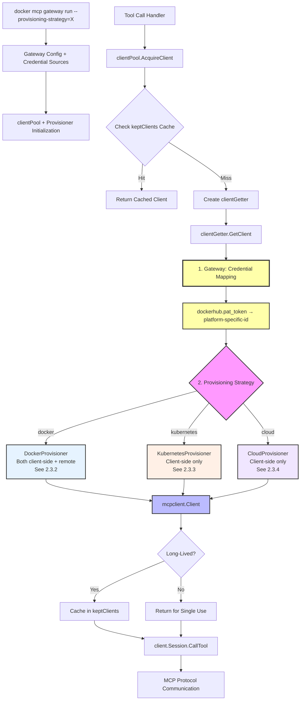
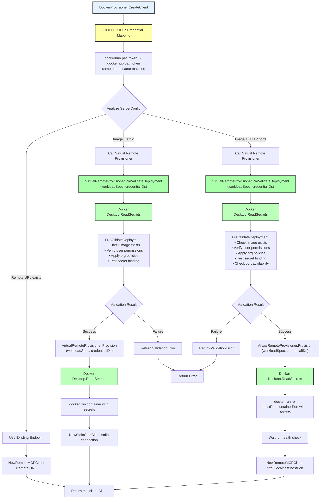
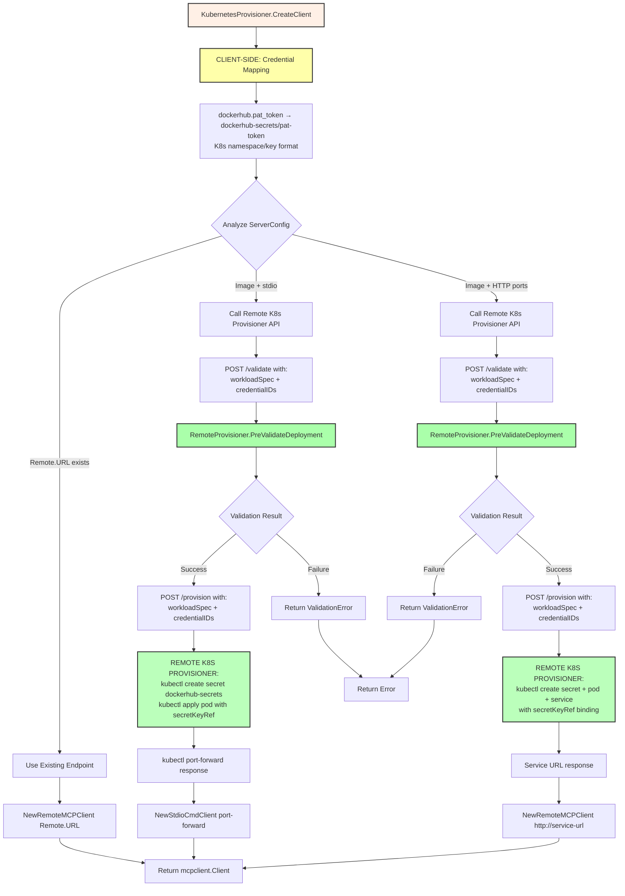
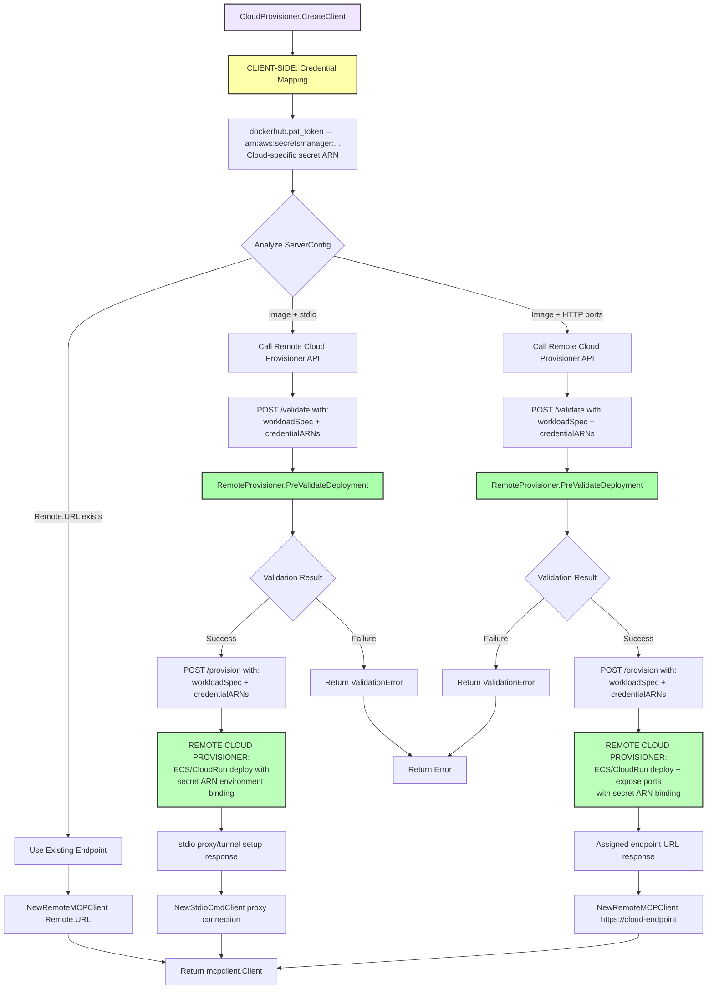
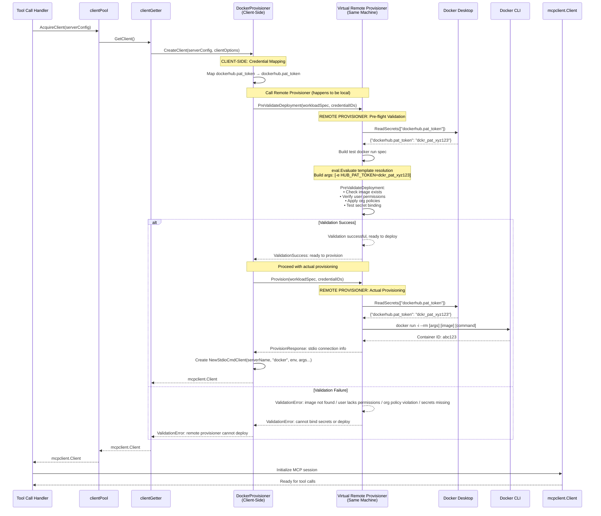

# Pluggable Provisioning Strategies for Docker MCP Gateway

## Introduction

The goal of this specification is to introduce the concept of a provisioning strategy where the default provisioning strategy is the one that's already used by the Gateway today where everything runs using the local Docker engine by pulling images locally etc. but where a future version allows for different provisioning strategies including not provisioning for instance just running commands directly if it's an NPM thing. Well actually let's not include that one but I think mostly it's like where or how we run these images and so the default provisioning will do this thing it does today. I think I'll have another version that allows us to essentially provision these things on our Kubernetes cluster using kubectl and then ultimately we'll have a version that allows us to do this on a remote some remote provisioning engine that's proprietary and so it has to sort of fit these three use cases existing Docker thing, Kubernetes based thing and third party provisioning service like a cloud service and ultimately what will happen is we need to be able to just take an image and then return a handle that has access to the standard IO and or any endpoints that are like network endpoints that are exposed by the running server. I think that's sort of what we get back from these provisioners and so let's start to jot all this down in the rough thoughts.

## 1. Rough Thoughts
*This section will capture initial ideas and insights as they come up during our discussion.*

- **Core Abstraction - Image to Handle Pattern**: The fundamental operation is taking an image and returning a handle that provides access to stdio and network endpoints

The provisioning system needs to abstract away the deployment target (local Docker, Kubernetes, cloud service) while maintaining a consistent interface. The key insight is that regardless of where something runs, the client needs the same capabilities: ability to communicate via stdio for MCP protocol and access to any exposed network endpoints. This suggests a common interface where provisioners implement a contract that takes container images and returns standardized handles.

- **Three Target Deployment Strategies**: Local Docker (current), Kubernetes via kubectl, and proprietary cloud services

Each deployment target has different operational characteristics but serves the same fundamental purpose. Local Docker provides immediate local execution with full control. Kubernetes enables cluster-based scaling and resource management. Proprietary cloud services could offer specialized capabilities or compliance features. The abstraction layer should make these deployment choices transparent to the MCP client while allowing for target-specific optimizations.

- **Strategy Pattern Architecture**: Default provisioning maintains current behavior while enabling pluggable alternatives

This follows a classic strategy pattern where the provisioning behavior can be swapped without changing the core gateway logic. The current Docker-based provisioning becomes the default implementation, ensuring backward compatibility while opening the door for additional provisioning strategies. This architectural approach allows for gradual adoption and testing of new provisioning methods.

- **Gateway-Level Provisioning Configuration**: Provisioning strategy is specified at gateway startup via `docker mcp gateway run` command flags

Analysis of the current codebase shows that provisioning strategy configuration should happen at the gateway level when starting a session. The gateway command already accepts multiple configuration flags (catalogs, registries, configs) and this pattern should extend to provisioning strategy selection. Each strategy can have its own specific configuration requirements (like Kubernetes cluster info) while maintaining a common interface.

- **Current Server Provisioning Flow**: Catalog entries → ServerConfig → clientPool.AcquireClient() → container execution via Docker CLI

The existing flow shows clear cut lines: 1) Configuration parsing reads catalog entries into ServerConfig structs containing image, command, volumes, secrets, etc. 2) The clientPool handles server lifecycle through AcquireClient/ReleaseClient methods. 3) clientGetter.GetClient() performs the actual provisioning by building Docker run commands and executing them. This final step in clientGetter.GetClient() (lines 354-428 in clientpool.go) is the primary insertion point for provisioning abstraction.

- **Catalog Entry as Provisioning Specification**: The existing catalog ServerConfig provides rich specification that can drive any provisioning target

The current catalog format already contains all necessary provisioning information: container image, command overrides, volume mounts, environment variables, secrets, network settings, and resource constraints. This comprehensive specification can be passed directly to any provisioning strategy, allowing each strategy to translate these requirements into target-specific operations (Docker commands, Kubernetes manifests, or cloud service API calls).

- **Client Pool Integration Point**: The provisioning abstraction should integrate at the clientGetter level within clientPool

The clientPool already manages server lifecycle and provides the natural boundary for provisioning abstraction. Rather than replacing the entire clientPool, the abstraction should be introduced in the clientGetter.GetClient() method where actual server instantiation occurs. This allows different provisioning strategies to be plugged in while maintaining the existing client lifecycle management, session caching, and cleanup patterns.

- **HTTP Transport Support Gap**: Current system supports remote HTTP endpoints but NOT containerized HTTP servers

Analysis shows the current system supports two distinct scenarios: 1) Remote HTTP/SSE/Streaming endpoints via `NewRemoteMCPClient()` when `ServerConfig.Spec.Remote.URL` is set, and 2) Containerized stdio servers via `NewStdioCmdClient()` when `ServerConfig.Spec.Image` is set. However, there's no support for containerized servers that expose HTTP endpoints - where you start a Docker container with an image AND then connect to HTTP endpoints it exposes. This represents a missing capability that the provisioning abstraction must address.

- **Three Transport Scenarios for Provisioning**: Stdio containers, remote HTTP endpoints, and the missing containerized HTTP servers

The provisioning system needs to handle: 1) **Containerized Stdio** (current): Docker image → stdio communication via `NewStdioCmdClient("docker", args...)`, 2) **Remote HTTP** (current): Well-known URL → HTTP communication via `NewRemoteMCPClient()`, and 3) **Containerized HTTP** (missing): Docker image → container with exposed ports → HTTP communication to container endpoints. The third scenario requires provisioners to both deploy containers AND return connection information for HTTP-based clients.

- **Real Catalog Examples Show Container Command Usage**: Analysis of docker-mcp.yaml shows how command field specifies what runs inside containers

Examining the actual Docker catalog file shows examples like: `dockerhub` server with `command: ["--transport=stdio", "--username={{dockerhub.username}}"]` - these are the arguments passed to the MCP server binary **inside the container**, not gateway transport configuration. The gateway runs `docker run [args] [image] ["--transport=stdio", "--username=..."]` where the command tells the containerized MCP server how to operate. This clarifies that `command` specifies the container entrypoint arguments, while transport is determined by how the gateway connects to the container (currently always stdio via `NewStdioCmdClient`).

- **Secret and Config Injection System**: Current system uses multi-source approach with Docker Desktop integration and templating

Analysis reveals a sophisticated secret management system: 1) **Secrets**: Retrieved from Docker Desktop secrets API (`c.docker.ReadSecrets()`) or `.env` files, stored as `map[string]string` of secret name to value, 2) **Config**: User configuration loaded from `config.yaml` files, provides template values like `dockerhub.username`, 3) **Templating**: `eval.Evaluate("{{dockerhub.username}}", serverConfig.Config)` resolves `{{key.subkey}}` patterns using dot notation path traversal, 4) **Container Injection**: Secrets become environment variables (`-e SECRETNAME=value`), while templated config values are resolved in `command` and `env` fields before container execution.

- **Provisioning Strategy Impact on Secret Binding**: Different deployment targets require different secret injection mechanisms

The current Docker-based approach directly controls container environment variables, but other provisioning strategies need different mechanisms: 1) **KubernetesProvisioner**: Must translate secrets to K8s Secrets/ConfigMaps and mount them or use `env` fields in Pod specs, 2) **RemoteProvisioner**: Must handle secrets through cloud provider APIs (AWS Secrets Manager, Azure Key Vault, etc.) or inject via cloud-specific environment variable mechanisms, 3) **Template Resolution**: All provisioners need access to the same `eval.Evaluate()` system for resolving `{{config.key}}` patterns, but the final injection method varies by target platform.

- **Credential Mapping Specification Need**: Provisioners require shared credential mapping spec to bridge secret sources and deployment targets

The gap between Docker Desktop's secret management and deployment targets reveals a need for credential mapping specifications. Each provisioning request needs: 1) **Source Credentials**: What secrets/config values are needed from Docker Desktop or config files, 2) **Target Mapping**: How those credentials map to the target platform's secret mechanism (K8s Secret names, cloud secret ARNs, etc.), 3) **Container Binding**: How the target platform injects those secrets into containers (env vars, mounted files, etc.). This implies provisioners need a "Can I provision this?" capability check before actual deployment.

- **Authentication and User Context**: Provisioning strategies need user authentication and context to resolve credentials

Cross-platform provisioning implies authentication challenges: 1) **Gateway-Level Auth**: Users must authenticate to provisioning targets (K8s clusters, cloud accounts), 2) **User Context Resolution**: Each provisioner needs user identity to access their secrets/configs in the target platform, 3) **Capability Validation**: Provisioners must validate they can resolve all required credentials for a given user before attempting deployment. This suggests provisioners need both authentication context and pre-flight validation capabilities.

## 2. Analysis
*This section will organize and examine the rough thoughts more systematically.*

### 2.0 Unified Provisioner Architecture - Credential Separation Model

The secret management investigation reveals a clean separation-of-concerns approach where **credential management** is separate from **provisioning**. Every provisioning scenario follows the same two-part pattern.

**Universal Pattern**:
- **Client-side (Gateway)**: Maps semantic credential names to platform-specific credential IDs
- **Remote Provisioner**: Takes workload specification + credential ID bindings, uses platform-native mechanisms to deploy and bind credentials

**Key Insight**: Even Docker provisioning follows this pattern - we just implement both the client-side and "remote" provisioner parts on the same machine.

**Trust Boundaries**:
- **Docker case**: Whole localhost (Docker Desktop + Gateway in same trust boundary)
- **Remote cases**: Network boundary between Gateway and remote provisioner

### 2.1 Kubernetes Provisioning Example - Working Model

Let's trace how a server like `dockerhub` with secrets would work across both Docker and Kubernetes provisioning:

**Server Configuration** (same for both):
```yaml
dockerhub:
  image: mcp/dockerhub
  command: ["--transport=stdio", "--username={{dockerhub.username}}"]
  secrets:
    - name: dockerhub.pat_token  
      env: HUB_PAT_TOKEN
  env:
    - name: HUB_USERNAME
      value: "{{dockerhub.username}}"
```

**Docker Provisioning** (current):
1. **Credential Resolution**: `c.docker.ReadSecrets(["dockerhub.pat_token"])` → `"dckr_pat_xyz"`
2. **Template Resolution**: `eval.Evaluate("{{dockerhub.username}}", config)` → `"myuser"`  
3. **Container Creation**: `docker run -e HUB_PAT_TOKEN=dckr_pat_xyz -e HUB_USERNAME=myuser mcp/dockerhub --transport=stdio --username=myuser`
4. **Client Connection**: `NewStdioCmdClient()` connects via stdio

**Kubernetes Provisioning** (proposed):
1. **Pre-flight Validation**: 
   - Check K8s cluster access with user's kubeconfig
   - Validate user can create Secrets/Pods in target namespace
   - Confirm Docker Desktop secrets are accessible
2. **Credential Mapping**:
   - Docker Desktop secret `dockerhub.pat_token` → K8s Secret `dockerhub-secrets` key `pat-token`
   - Config value `dockerhub.username` → K8s ConfigMap `dockerhub-config` key `username`
3. **Resource Creation**:
   ```yaml
   # kubectl create secret generic dockerhub-secrets --from-literal=pat-token=dckr_pat_xyz
   # kubectl create configmap dockerhub-config --from-literal=username=myuser
   # kubectl apply -f pod.yaml
   apiVersion: v1
   kind: Pod
   spec:
     containers:
     - name: dockerhub
       image: mcp/dockerhub
       command: ["--transport=stdio", "--username=myuser"]  # template resolved
       env:
       - name: HUB_PAT_TOKEN
         valueFrom:
           secretKeyRef:
             name: dockerhub-secrets
             key: pat-token
       - name: HUB_USERNAME
         valueFrom:
           configMapKeyRef:
             name: dockerhub-config  
             key: username
   ```
4. **Client Connection**: 
   - For stdio: `kubectl port-forward` + `NewStdioCmdClient()` 
   - For HTTP: Service creation + `NewRemoteMCPClient()`

**Key Insights from Kubernetes Example**:
- **Credential Translation**: Docker Desktop secrets must be copied into K8s Secrets
- **Template Resolution**: Happens before resource creation, same as Docker  
- **Authentication Context**: User's kubeconfig provides K8s access, Docker Desktop provides secrets
- **Resource Lifecycle**: Provisioner manages K8s resources (Secrets, ConfigMaps, Pods, Services)
- **Connection Bridging**: Different transport mechanisms require different K8s networking setup

### 2.1 Analysis of Current Architecture and Requirements

The current Docker MCP Gateway architecture reveals a clear separation of concerns that naturally accommodates pluggable provisioning:

**Configuration Layer**: The gateway accepts multiple configuration sources (catalogs, registries, configs) through command-line flags. This pattern establishes precedent for provisioning strategy selection at startup time. The rich `ServerConfig` specification contains all deployment requirements regardless of target platform.

**Lifecycle Management Layer**: The `clientPool` provides sophisticated server lifecycle management including session caching, long-lived server support, client acquisition/release patterns, and cleanup orchestration. This layer is provisioning-agnostic and should remain unchanged.

**Provisioning Execution Layer**: The `clientGetter.GetClient()` method contains all Docker-specific provisioning logic. This is where container arguments are built, Docker CLI commands are executed, and MCP client initialization occurs. This layer is the natural boundary for abstraction.

**Client Interface Layer**: The system returns `mcpclient.Client` instances that provide standardized access to MCP protocol capabilities regardless of underlying provisioning method. This interface already abstracts away deployment details from the gateway's perspective.

The analysis shows that the current architecture accidentally implements a form of dependency inversion - the high-level gateway logic depends on abstractions (`mcpclient.Client`) rather than concrete implementations, making provisioning strategy pluggability a natural extension.

### 2.2 Revised Architecture Based on Client Lifecycle Analysis

After analyzing the actual client lifecycle, the architecture needs to be simpler and more targeted. The key insight is that **`mcpclient.Client` already IS the abstraction** - it encapsulates both the running server and the MCP communication channel.

**Current Client Creation Flow**:
1. Tool call handler invokes `clientPool.AcquireClient()`
2. ClientPool checks cache for long-lived clients or creates new `clientGetter`
3. `clientGetter.GetClient()` creates the actual client via `NewStdioCmdClient()`, `NewRemoteMCPClient()`, etc.
4. Client initialization happens within `GetClient()` including MCP protocol initialization
5. Client is returned and used for tool/prompt/resource calls
6. Client is released (either cached for long-lived or closed for short-lived)

**Proposed Provisioning Integration**:

```go
// Provisioner interface replaces the direct client creation logic in clientGetter.GetClient()
type Provisioner interface {
    // CreateClient creates and initializes an MCP client for the given server configuration
    CreateClient(ctx context.Context, config *catalog.ServerConfig, opts ClientOptions) (mcpclient.Client, error)
}

type ClientOptions struct {
    Verbose       bool
    Networks      []string
    ReadOnly      *bool
    ServerSession *mcp.ServerSession
    Server        *mcp.Server
    InitParams    *mcp.InitializeParams
}
```

**Key Changes**:
1. **Provisioner replaces client creation logic** in `clientGetter.GetClient()` (lines 360-395)
2. **DockerProvisioner** implements current behavior: stdio containers + remote HTTP endpoints
3. **KubernetesProvisioner** creates clients for Kubernetes-deployed servers (stdio + HTTP)
4. **RemoteProvisioner** delegates to cloud APIs for server deployment + client creation
5. **All existing lifecycle management remains unchanged** - clientPool, caching, cleanup, etc.

**Multi-Transport Support**:
Each provisioner must handle three transport scenarios:
- **Stdio Transport**: Container/server with stdin/stdout communication (`NewStdioCmdClient`)
- **Remote HTTP**: Pre-existing HTTP endpoint (`NewRemoteMCPClient`)  
- **Containerized HTTP**: Deploy container + connect to exposed HTTP ports (NEW capability)

**Implementation Strategy**:
- Gateway accepts `--provisioning-strategy=docker|kubernetes|remote` flag
- ClientPool receives provisioner instance during initialization
- `clientGetter` uses `provisioner.CreateClient()` instead of direct client instantiation
- Provisioners examine ServerConfig to determine transport type and deployment strategy
- For containerized HTTP: provisioner deploys container, waits for health check, returns HTTP client
- Long-lived vs short-lived behavior is preserved through existing clientPool caching

**Backward Compatibility**:
- Default DockerProvisioner maintains exact current behavior for stdio + remote scenarios
- Adds new containerized HTTP capability that doesn't exist today
- Existing `NewStdioCmdClient()`, `NewRemoteMCPClient()` paths preserved
- No changes to client interface or tool/prompt/resource handlers

### 2.3 Revised Architecture Diagrams - Unified Provisioner Model

#### 2.3.1 High-Level Unified Provisioning Flow



#### 2.3.2 DockerProvisioner - Both Client-Side and Remote Provisioner



#### 2.3.3 KubernetesProvisioner - Client-Side Only



#### 2.3.4 CloudProvisioner - Client-Side Only



#### 2.3.5 Docker Provisioner Sequence Diagram - Pre-flight Validation



## 3. Distillation
*This section will extract the core insights and key principles from the analysis.*

### Unified Provisioner Architecture

The secret management investigation reveals a clean separation-of-concerns approach that makes the architecture much more consistent. **Every provisioning scenario has two parts:**

1. **Client-side (Gateway)**: Maps semantic names to platform credential IDs
2. **Remote Provisioner**: Takes workload + credential IDs and binds using platform mechanisms

**Docker Case** (we implement both parts):
- **Client-side**: Gateway maps `dockerhub.pat_token` → `"dockerhub.pat_token"` (same name)
- **"Remote" Provisioner**: Our Docker provisioner calls `c.docker.ReadSecrets()` and injects via `-e`
- **Trust boundary**: Whole localhost (Docker Desktop + our gateway)

**Kubernetes Case** (we implement client-side only):
- **Client-side**: Gateway maps `dockerhub.pat_token` → `"dockerhub-secrets/pat-token"`
- **Remote Provisioner**: Kubernetes binds using `secretKeyRef` mechanisms
- **Trust boundary**: Network boundary between gateway and K8s cluster

**Cloud Case** (we implement client-side only):
- **Client-side**: Gateway maps `dockerhub.pat_token` → `"arn:aws:secretsmanager:..."`
- **Remote Provisioner**: Cloud service binds using native secret injection
- **Trust boundary**: Network boundary between gateway and cloud API

### Key Insight

In the Docker case, we're both the gateway AND the remote provisioner - we just happen to run on the same machine. But architecturally, we're still doing the same credential mapping → platform binding pattern as the other cases.

**This makes the provisioning interface much cleaner**: it's always "workload spec + credential ID mappings" regardless of whether the "remote" provisioner is localhost Docker or an actual remote service.

**Consistent Pattern Across All Provisioners**:
```
Semantic Name → Platform Credential ID → Platform Native Binding
dockerhub.pat_token → "platform-specific-id" → env injection/secretKeyRef/etc
```

**Unified Architecture Benefits**:
- **Same interface everywhere**: All provisioners take workload spec + credential mappings
- **Clear responsibility separation**: Gateway handles credential mapping, provisioner handles platform binding
- **Consistent trust model**: Every scenario has a clear trust boundary
- **Transport agnostic**: Provisioners can return stdio, HTTP, or streaming clients

### Go Interface Definitions

Based on the diagrams, unified architecture, and analysis of the existing `catalog.ServerConfig` structure, here are the interfaces with proper adapter layer separation:

```go
// Provisioner represents the client-side provisioning interface
type Provisioner interface {
    // CreateClient creates and initializes an MCP client for the given server configuration
    // Handles translation from catalog.ServerConfig to provisioner-specific ProvisionerSpec
    CreateClient(ctx context.Context, config *catalog.ServerConfig, opts ClientOptions) (mcpclient.Client, error)
    
    // HealthCheck verifies the provisioner is available and can fulfill dependencies
    HealthCheck(ctx context.Context) error
}

// ClientOptions contains options for client creation that are passed from clientPool
type ClientOptions struct {
    Verbose       bool
    Networks      []string
    ReadOnly      *bool
    ServerSession *mcp.ServerSession
    Server        *mcp.Server
    InitParams    *mcp.InitializeParams
}

// RemoteProvisioner represents the remote provisioning interface that handles
// actual deployment and dependency fulfillment on the target platform
type RemoteProvisioner interface {
    // PreValidateDeployment performs pre-flight validation to check if deployment is feasible
    // Validates that all secrets, env vars, and dependencies in the ProvisionerSpec can be fulfilled
    PreValidateDeployment(ctx context.Context, spec *ProvisionerSpec) error
    
    // Provision deploys the server and returns connection information
    // Only called after successful PreValidateDeployment
    Provision(ctx context.Context, spec *ProvisionerSpec) (*ProvisionedServer, error)
    
    // Deprovision cleans up the deployed server
    Deprovision(ctx context.Context, serverID string) error
    
    // HealthCheck verifies the remote provisioner is available and accessible
    HealthCheck(ctx context.Context) error
}

// ProvisionerSpec is the standardized provisioner specification that adapts catalog.ServerConfig
// This allows provisioner specs to evolve independently from catalog formats
type ProvisionerSpec struct {
    Name        string                 `json:"name"`
    Image       string                 `json:"image"`
    Command     []string               `json:"command"`
    Environment map[string]string      `json:"environment"`      // Resolved env vars
    Secrets     []ProvisionerSecret    `json:"secrets"`          // Secret requirements
    Volumes     []string               `json:"volumes"`
    Transport   ProvisionerTransport   `json:"transport"`
    Security    ProvisionerSecurity    `json:"security"`
    Resources   ProvisionerResources   `json:"resources"`
    Config      map[string]any         `json:"config"`           // Template values for resolution
}

// ProvisionerSecret describes a secret requirement for the provisioner
type ProvisionerSecret struct {
    Name        string `json:"name"`         // Semantic name (e.g., "dockerhub.pat_token")
    EnvVar      string `json:"env_var"`      // Target environment variable name
    Required    bool   `json:"required"`     // Whether this secret is required
}

// ProvisionerTransport specifies how the MCP client should connect to the provisioned server
type ProvisionerTransport struct {
    Type     string            `json:"type"`     // "stdio", "http", "sse", "streaming"
    Ports    []int             `json:"ports"`    // For HTTP/streaming transports
    Metadata map[string]string `json:"metadata"` // Transport-specific configuration
}

// ProvisionerSecurity contains security-related deployment options
type ProvisionerSecurity struct {
    DisableNetwork bool     `json:"disable_network"`
    AllowHosts     []string `json:"allow_hosts"`
    ReadOnly       bool     `json:"read_only"`
}

// ProvisionerResources specifies resource constraints for the deployment
type ProvisionerResources struct {
    CPUs   int    `json:"cpus"`
    Memory string `json:"memory"`
}

// ProvisionedServer contains information about a successfully deployed server
type ProvisionedServer struct {
    ID           string            `json:"id"`            // Unique identifier for the provisioned server
    Name         string            `json:"name"`          // Server name from catalog
    TransportURL string            `json:"transport_url"` // Connection URL (stdio://id, http://host:port, etc.)
    Metadata     map[string]string `json:"metadata"`      // Provisioner-specific metadata
    Platform     string            `json:"platform"`      // "docker", "kubernetes", "cloud"
}
```

### Implementation Strategy by Platform

**DockerProvisioner** (implements both Provisioner and RemoteProvisioner):
```go
type DockerProvisioner struct {
    docker   docker.Client
    networks []string
    options  Options
}

// Implements Provisioner interface
func (d *DockerProvisioner) CreateClient(ctx context.Context, config *catalog.ServerConfig, opts ClientOptions) (mcpclient.Client, error) {
    // 1. ADAPTER LAYER: Translate catalog.ServerConfig to ProvisionerSpec
    spec, err := d.adaptServerConfigToSpec(config)
    if err != nil {
        return nil, err
    }
    
    // 2. Call local RemoteProvisioner methods (virtual remote provisioner)
    if err := d.PreValidateDeployment(ctx, spec); err != nil {
        return nil, err
    }
    
    server, err := d.Provision(ctx, spec)
    if err != nil {
        return nil, err
    }
    
    // 3. Create appropriate mcpclient.Client based on transport
    return d.createMCPClient(server, opts)
}

func (d *DockerProvisioner) adaptServerConfigToSpec(config *catalog.ServerConfig) (*ProvisionerSpec, error) {
    // Translate catalog.ServerConfig to ProvisionerSpec
    spec := &ProvisionerSpec{
        Name:    config.Name,
        Image:   config.Spec.Image,
        Command: config.Spec.Command,
        Volumes: config.Spec.Volumes,
        Config:  config.Config,
        Environment: make(map[string]string),
    }
    
    // Adapt secrets
    for _, secret := range config.Spec.Secrets {
        spec.Secrets = append(spec.Secrets, ProvisionerSecret{
            Name:     secret.Name,
            EnvVar:   secret.Env,
            Required: true,
        })
    }
    
    // Adapt environment variables with template resolution
    for _, env := range config.Spec.Env {
        resolved := eval.Evaluate(env.Value, config.Config)
        spec.Environment[env.Name] = fmt.Sprintf("%v", resolved)
    }
    
    // Adapt security settings
    spec.Security = ProvisionerSecurity{
        DisableNetwork: config.Spec.DisableNetwork,
        AllowHosts:     config.Spec.AllowHosts,
        ReadOnly:       false, // Could be set from opts.ReadOnly
    }
    
    // Determine transport type
    spec.Transport = d.determineTransport(config.Spec)
    
    return spec, nil
}

// Implements RemoteProvisioner interface - handles actual Docker operations
func (d *DockerProvisioner) PreValidateDeployment(ctx context.Context, spec *ProvisionerSpec) error {
    // Validate all dependencies in ProvisionerSpec can be fulfilled:
    // - Check image exists
    // - Verify user permissions  
    // - Apply org policies
    // - Test that all required secrets are available
    // - Check port availability (for HTTP transports)
    
    for _, secret := range spec.Secrets {
        if secret.Required {
            // Check if secret exists in Docker Desktop secrets
            if _, err := d.docker.ReadSecrets(ctx, []string{secret.Name}, false); err != nil {
                return fmt.Errorf("required secret %s not available: %w", secret.Name, err)
            }
        }
    }
    
    return nil
}

func (d *DockerProvisioner) Provision(ctx context.Context, spec *ProvisionerSpec) (*ProvisionedServer, error) {
    // Use ProvisionerSpec instead of catalog.ServerConfig:
    // - Build Docker run args from spec
    // - Inject secrets as environment variables
    // - Execute docker run command
    // - Return ProvisionedServer with connection info
}
```

**KubernetesProvisioner** (implements Provisioner, delegates to remote):
```go
type KubernetesProvisioner struct {
    client     *http.Client
    endpoint   string
    kubeconfig string
}

// Implements Provisioner interface
func (k *KubernetesProvisioner) CreateClient(ctx context.Context, config *catalog.ServerConfig, opts ClientOptions) (mcpclient.Client, error) {
    // 1. ADAPTER LAYER: Translate catalog.ServerConfig to ProvisionerSpec
    spec, err := k.adaptServerConfigToSpec(config)
    if err != nil {
        return nil, err
    }
    
    // 2. Call remote K8s provisioner via HTTP API
    if err := k.callRemotePreValidate(ctx, spec); err != nil {
        return nil, err
    }
    
    server, err := k.callRemoteProvision(ctx, spec)
    if err != nil {
        return nil, err
    }
    
    // 3. Create MCP client for K8s-deployed server
    return k.createMCPClient(server, opts)
}

func (k *KubernetesProvisioner) adaptServerConfigToSpec(config *catalog.ServerConfig) (*ProvisionerSpec, error) {
    // K8s-specific adaptation logic
    // May handle secrets differently, ports differently, etc.
    // This is where K8s-specific transformations happen
}

func (k *KubernetesProvisioner) callRemotePreValidate(ctx context.Context, spec *ProvisionerSpec) error {
    // POST /prevalidate with ProvisionerSpec
    // Remote K8s provisioner validates using the standardized spec
}

func (k *KubernetesProvisioner) callRemoteProvision(ctx context.Context, spec *ProvisionerSpec) (*ProvisionedServer, error) {
    // POST /provision with ProvisionerSpec
    // Remote K8s provisioner uses standardized spec format
}
```

**CloudProvisioner** (implements Provisioner, delegates to cloud APIs):
```go
type CloudProvisioner struct {
    client   *http.Client
    endpoint string
    provider string // "aws", "gcp", "azure"
}

func (c *CloudProvisioner) CreateClient(ctx context.Context, config *catalog.ServerConfig, opts ClientOptions) (mcpclient.Client, error) {
    // 1. ADAPTER LAYER: Cloud-specific adaptation
    spec, err := c.adaptServerConfigToSpec(config)
    if err != nil {
        return nil, err
    }
    
    // 2. Call remote cloud provisioner with standardized spec
    // ... similar pattern to K8s
}

func (c *CloudProvisioner) adaptServerConfigToSpec(config *catalog.ServerConfig) (*ProvisionerSpec, error) {
    // Cloud-specific adaptation logic
    // May transform secrets to ARN references, handle cloud-specific networking, etc.
}
```

### Key Architecture Benefits

1. **Explicit adapter layer** - Each provisioner handles translation from `catalog.ServerConfig` to `ProvisionerSpec`
2. **Independent evolution** - Catalog format can change without affecting provisioner implementations
3. **Provisioner-specific adaptations** - Each provisioner can adapt the spec to its platform needs
4. **Standardized remote interface** - All remote provisioners work with the same `ProvisionerSpec` format
5. **Decoupling** - Provisioner specs can evolve independently from catalog schemas

## 4. Proposed Outline
*This section will structure the key findings into a coherent framework.*

## 5. Distillation and Thesis
*This section will present the refined thesis and core principles.*

## 6. Draft
*This section will contain the final working draft of the document.*